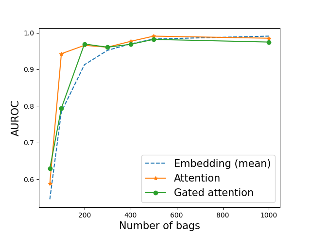
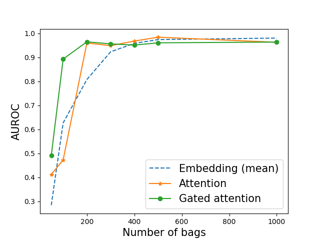
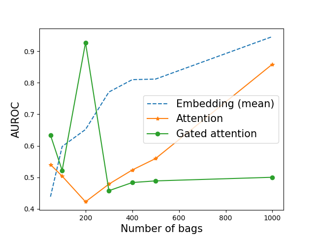

# Multiple instance learning for weakly supervised learning

* (2019-09-17) First upload the code to reproduce results of "Attention-based Deep Multiple Instance Learning", https://arxiv.org/abs/1802.04712
* (2019-09-20) Update the codes and upload results

# Task description
In our experiment, we have $N$ training bags each of which have $K$ instances. Each bag have a single image of digit '9' with the probability $p$.
Our aim is to obtain a model that classifies a given bag as a positive/negative when the bag have/don't have a image of number 9. 

We used multiple-instance learning algorithm, as described in "Attention-based Deep Multiple Instance Learning", https://arxiv.org/abs/1802.04712. 
We compare the mean-pooling, the attention-pooling, and the gated-attention-pooling of embeddings. 
Experimental results are shown as below. 

{: width="100" height="100"}
{: width="100" height="100"}
{: width="100" height="100"}
